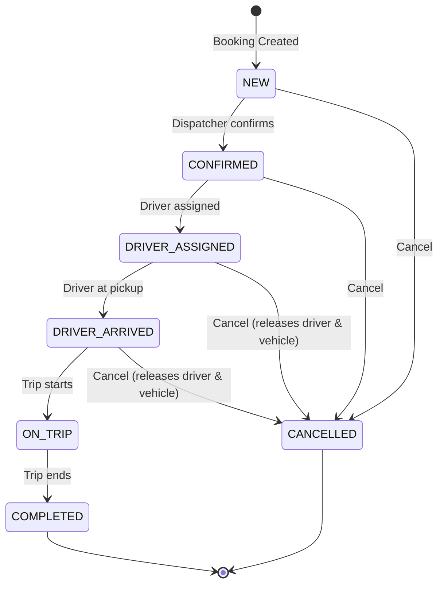
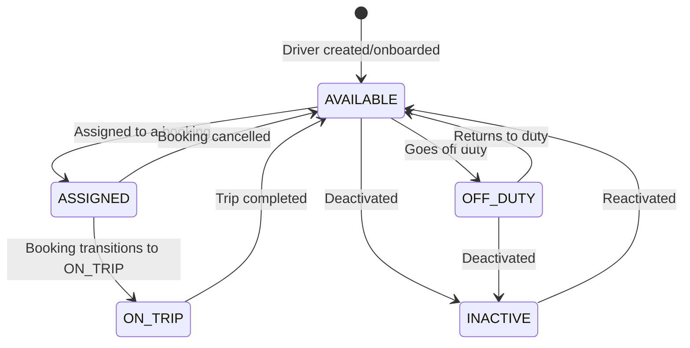
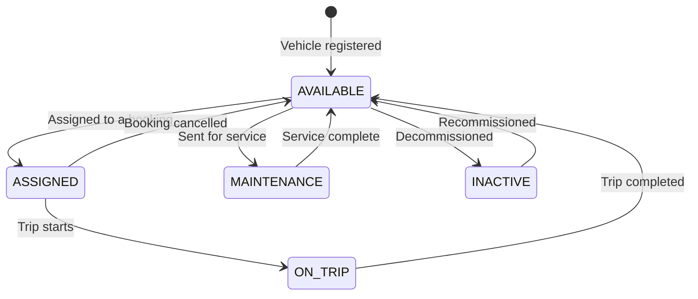
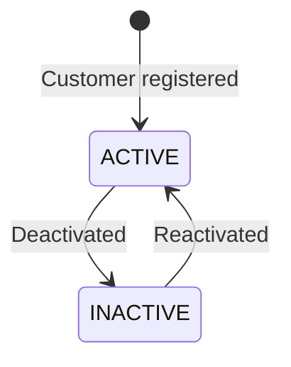
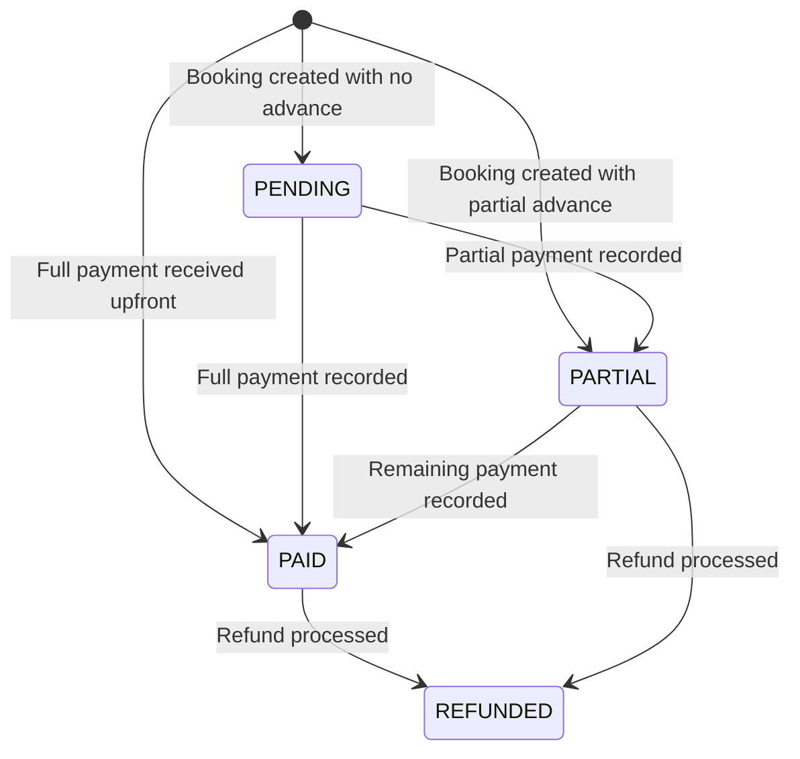
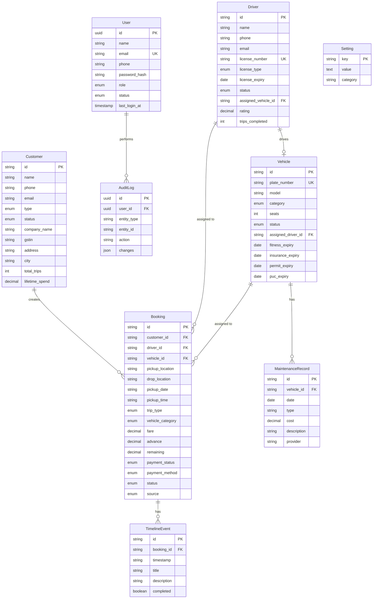
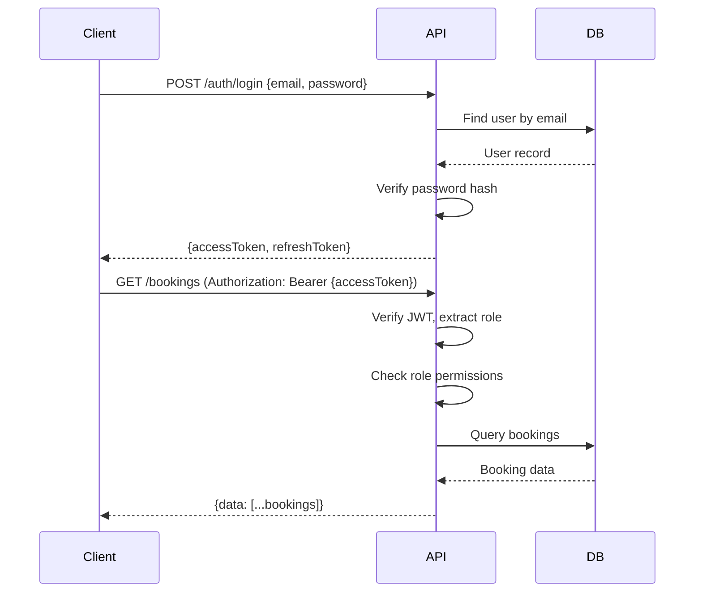
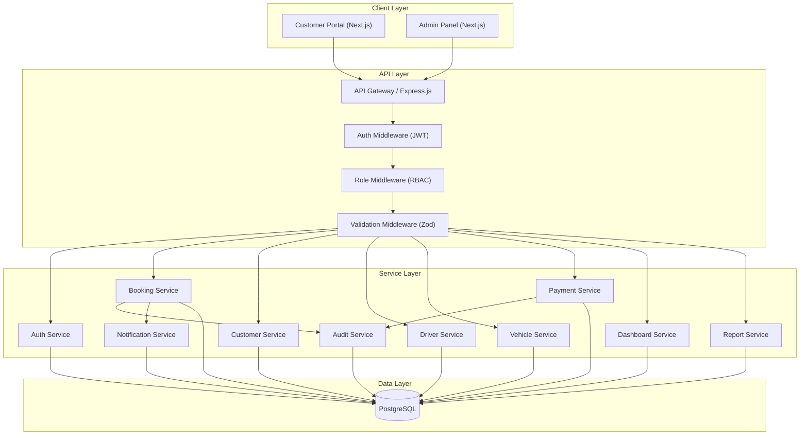
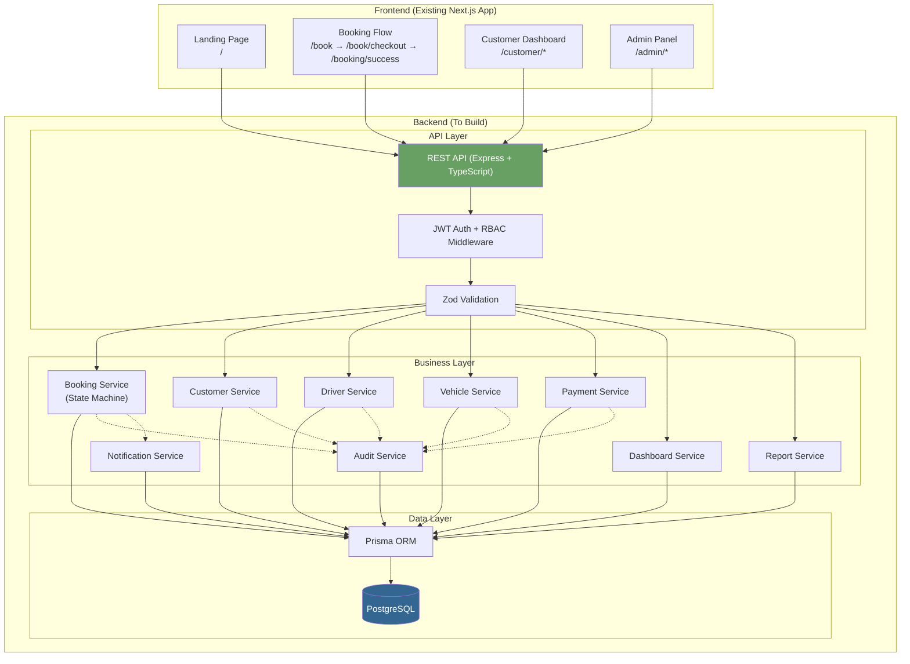

# TaxiCRM — Complete Backend System Design Specification

> Reverse-engineered from the existing Next.js 16 frontend codebase.
> This document serves as the authoritative backend-ready specification.

---

## 1. Executive Summary

**TaxiCRM** is a full-featured cab booking and fleet management CRM with two distinct interfaces:

1. **Customer Portal** — A public-facing website where passengers search for cabs, select vehicles, book rides, track bookings, and manage their profiles.
2. **Admin Operations Panel** — An internal dashboard for dispatchers/managers to manage bookings, assign drivers and vehicles, track fleet status, handle payments, view reports, and configure business settings.

### Technology Stack (Frontend — Current)

| Layer | Technology |
|---|---|
| Framework | Next.js 16 (App Router) |
| Language | TypeScript 5 |
| Styling | Tailwind CSS 4 |
| Forms | React Hook Form + Zod |
| Charts | Recharts 3 |
| State | React Context (in-memory, mock data) |
| Icons | Lucide React |

### Current State

- **Zero backend** — all data is hardcoded mock data in `src/data/mockData.ts` and `src/data/customerContent.ts`
- **Zero API calls** — all CRUD is done via React Context in-memory mutations
- **Zero authentication** — no login/logout, no session, no RBAC
- **Zero persistence** — page refresh resets all data

### Scale Indicators from Mock Data

- 22 customers, 12 drivers, 12 vehicles, 48 bookings
- Business location: **Patna, Bihar, India**
- Currency: **INR (₹)**
- Booking IDs: `PAT-2026-XXXXX` pattern
- Customer types: Retail + Corporate

---

## 2. Frontend Module Inventory

### Route Map

```
/                           → Customer Landing Page (marketing + quick search)
/book                       → Vehicle Selection (Step 1 of booking)
/book/checkout              → Passenger Details & Confirmation (Step 2)
/booking/success            → Booking Confirmation Page
/customer                   → Customer Dashboard
/customer/bookings          → Customer Booking History
/customer/bookings/[id]     → Customer Booking Detail
/customer/profile           → Customer Profile Management
/admin                      → Operations Dashboard (dispatcher hub)
/admin/bookings             → Booking Management (CRUD + dispatch)
/admin/bookings/[id]        → Trip Operations Sheet (detailed booking lifecycle)
/admin/customers            → Customer Management (CRUD)
/admin/customers/[id]       → Customer Detail + History
/admin/drivers              → Driver Management (CRUD + assignments)
/admin/drivers/[id]         → Driver Detail + Trip History + Documents
/admin/vehicles             → Fleet Management (CRUD + assignments)
/admin/vehicles/[id]        → Vehicle Detail + Compliance + Maintenance
/admin/payments             → Payment Ledger (collections, refunds, receipts)
/admin/reports              → Analytics Dashboard (revenue, routes, fleet)
/admin/calendar             → Calendar Dispatch View (day/week/month)
/admin/settings             → System Configuration
```

### Screen Inventory

| # | Screen | Business Operation | Data Entities |
|---|---|---|---|
| 1 | Landing Page | Customer acquisition, cab search | Static content, vehicle catalog |
| 2 | Vehicle Selection | Browse & select vehicle for trip | Vehicle categories, pricing |
| 3 | Checkout | Capture passenger details, confirm booking | Booking, Customer |
| 4 | Booking Success | Post-booking confirmation | Booking |
| 5 | Customer Dashboard | Customer self-service portal | Booking, Customer |
| 6 | Customer Bookings | Trip history & management | Booking |
| 7 | Customer Booking Detail | Full trip details, timeline, OTP | Booking, Driver, Vehicle |
| 8 | Customer Profile | Profile & preferences management | Customer |
| 9 | Operations Dashboard | Real-time dispatch hub | Booking, Driver, Vehicle, KPIs |
| 10 | Booking Management | Full CRUD + dispatch operations | Booking, Driver, Vehicle |
| 11 | Trip Operations Sheet | Detailed booking lifecycle view | Booking, Customer, Driver, Vehicle, Timeline |
| 12 | Customer Management | Customer CRUD | Customer, Booking, Payment |
| 13 | Customer Detail | Customer profile + booking/payment history | Customer, Booking |
| 14 | Driver Management | Driver CRUD + vehicle assignments | Driver, Vehicle |
| 15 | Driver Detail | Driver profile + trip history + documents | Driver, Booking, Vehicle |
| 16 | Fleet Management | Vehicle CRUD + driver assignments + maintenance | Vehicle, Driver |
| 17 | Vehicle Detail | Vehicle profile + compliance + maintenance history | Vehicle, Booking, Driver |
| 18 | Payment Ledger | Payment tracking, collections, refunds | Booking (payments embedded) |
| 19 | Reports | Revenue, route, fleet analytics | All entities (aggregated) |
| 20 | Calendar | Visual dispatch scheduling | Booking, Driver, Vehicle |
| 21 | Settings | System configuration | Settings (config) |

---

## 3. User Roles & Permissions

### Identified Roles (from frontend evidence)

The frontend Settings page contains a hardcoded `teamMembers` array revealing these roles:

| Role | Evidence |
|---|---|
| **Shift Controller** | Topbar shows "Vikram Sahay — Shift Controller" |
| **Super Admin** | Settings → Users tab shows "Super Admin" role |
| **Admin** | Settings → Users tab |
| **Dispatcher** | Settings → Users tab. Calendar page is clearly designed for dispatchers |
| **Accountant** | Settings → Users tab |
| **Customer** | Entire `/customer/*` portal |

> [!IMPORTANT]
> The frontend currently has **zero RBAC enforcement**. All admin pages are accessible without authentication. The roles are only visible as display labels in the Settings page. The backend must implement proper role-based access control.

### Role-Permission Matrix

| Permission | Customer | Dispatcher | Accountant | Admin | Super Admin |
|---|---|---|---|---|---|
| **Bookings** | | | | | |
| View own bookings | ✅ | — | — | — | — |
| Create booking (portal) | ✅ | — | — | — | — |
| Cancel own booking | ✅ | — | — | — | — |
| View all bookings | — | ✅ | ✅ (read) | ✅ | ✅ |
| Create booking (admin) | — | ✅ | — | ✅ | ✅ |
| Edit booking | — | ✅ | — | ✅ | ✅ |
| Cancel any booking | — | ✅ | — | ✅ | ✅ |
| Change booking status | — | ✅ | — | ✅ | ✅ |
| Assign driver | — | ✅ | — | ✅ | ✅ |
| Assign vehicle | — | ✅ | — | ✅ | ✅ |
| **Customers** | | | | | |
| View own profile | ✅ | — | — | — | — |
| Edit own profile | ✅ | — | — | — | — |
| View all customers | — | ✅ | ✅ | ✅ | ✅ |
| Create customer | — | ✅ | — | ✅ | ✅ |
| Edit customer | — | — | — | ✅ | ✅ |
| **Drivers** | | | | | |
| View all drivers | — | ✅ | — | ✅ | ✅ |
| Create driver | — | — | — | ✅ | ✅ |
| Edit driver | — | — | — | ✅ | ✅ |
| Assign vehicle to driver | — | ✅ | — | ✅ | ✅ |
| **Vehicles** | | | | | |
| View all vehicles | — | ✅ | — | ✅ | ✅ |
| Create vehicle | — | — | — | ✅ | ✅ |
| Edit vehicle | — | — | — | ✅ | ✅ |
| Set maintenance status | — | ✅ | — | ✅ | ✅ |
| **Payments** | | | | | |
| View all payments | — | — | ✅ | ✅ | ✅ |
| Record payment | — | — | ✅ | ✅ | ✅ |
| Process refund | — | — | ✅ | ✅ | ✅ |
| **Reports** | | | | | |
| View reports | — | — | ✅ | ✅ | ✅ |
| Export reports | — | — | ✅ | ✅ | ✅ |
| **Settings** | | | | | |
| View settings | — | — | — | ✅ | ✅ |
| Edit settings | — | — | — | — | ✅ |
| Manage users | — | — | — | — | ✅ |
| Reset demo data | — | — | — | — | ✅ |
| **Dashboard** | | | | | |
| View operations dashboard | — | ✅ | ✅ | ✅ | ✅ |
| View calendar | — | ✅ | — | ✅ | ✅ |

---

## 4. Complete Product Flows

### Flow 1: Customer Booking (Portal)

```
Customer visits landing page (/)
→ Fills quick search (pickup, drop, date, time, trip type)
→ Clicks "Search Cabs" → redirected to /book with query params
→ Browses vehicles by category (Sedan, SUV, Innova, Premium, Tempo Traveller)
→ Selects a vehicle → clicks "Proceed to Passenger Details"
→ Enters passenger info (name, phone, email)
→ Optionally enters corporate billing (company name, GSTIN)
→ Selects payment method (Cash, UPI, Corporate Credit)
→ Clicks "Confirm Booking"
→ System creates booking with status NEW
→ System auto-links or auto-creates customer record
→ Redirected to /booking/success with booking ID
→ Shows booking confirmation with OTP, driver info (if assigned)
→ Customer receives OTP code for ride verification
```

### Flow 2: Admin Booking (Dispatcher-Created)

```
Dispatcher clicks "New Booking" in admin dashboard
→ NewBookingModal opens with smart defaults based on trip type
→ Fills: customer info, route, date/time, vehicle category, fare, advance
→ Submits → createBooking() generates PAT-2026-XXXXX ID
→ Booking created with status NEW
→ Customer auto-linked or auto-created
→ Redirected to Trip Operations Sheet for the new booking
→ Dispatcher can now assign driver and vehicle
```

### Flow 3: Booking Lifecycle (Admin Dispatch)

```
Booking created (NEW)
→ Dispatcher reviews on Operations Dashboard or Bookings list
→ Confirms booking → status: CONFIRMED
→ Assigns driver from available pool → status: DRIVER_ASSIGNED
  → Driver status changes to ASSIGNED
  → Vehicle status changes to ASSIGNED
→ Driver arrives at pickup → status: DRIVER_ARRIVED
→ Trip starts → status: ON_TRIP
  → Driver status: ON_TRIP
  → Vehicle status: ON_TRIP
→ Trip completes → status: COMPLETED
  → Driver status: AVAILABLE, trip count incremented
  → Vehicle status: AVAILABLE
  → Payment auto-settled (remaining → 0 if full payment)
```

### Flow 4: Booking Cancellation

```
Admin or Customer initiates cancellation
→ Selects reason from predefined list:
  - Customer Request
  - Driver Unavailable
  - Vehicle Unavailable
  - Operational Issue
  - Flight Delayed / Cancelled
  - Duplicate Reservation
  - Other
→ Optionally adds notes
→ Status: CANCELLED
→ If driver was assigned → driver returns to AVAILABLE
→ If vehicle was assigned → vehicle returns to AVAILABLE
→ Timeline event recorded
```

### Flow 5: Payment Collection

```
Booking exists with fare and optional advance
→ Accountant/Admin opens Payment Ledger
→ Finds booking with PENDING or PARTIAL payment
→ Clicks "Log Payment"
→ Enters: amount, payment method, reference number, notes
→ recordPayment() adds amount to advance
→ Recalculates remaining = max(0, fare - advance)
→ Updates paymentStatus: PAID (if remaining=0), PARTIAL (if remaining>0)
→ Can view receipt (printable modal)
```

### Flow 6: Refund Processing

```
Booking with collected payment (PAID or PARTIAL)
→ Accountant clicks "Process Refund"
→ Enters: refund amount, reason (Cancellation/Dispute/Service Issue/Other), notes
→ recordRefund() subtracts amount from advance
→ Recalculates remaining
→ Updates paymentStatus to REFUNDED
```

### Flow 7: Driver-Vehicle Assignment

```
Admin creates a driver
→ Admin creates a vehicle
→ Admin assigns vehicle to driver:
  → assignVehicleToDriver(driverId, vehicleId)
  → Driver gets: assignedVehicleId, assignedVehiclePlate, vehicleModel
  → Vehicle gets: assignedDriverId, assignedDriverName, assignedDriverPhone
→ Or unassigns:
  → unassignVehicleFromDriver(driverId)
  → Clears both sides of the relationship
```

### Flow 8: Vehicle Maintenance

```
Admin identifies vehicle needing service
→ Clicks "Send to Maintenance" on vehicle detail or fleet page
→ Enters maintenance reason
→ setVehicleMaintenance(vehicleId, true, reason)
→ Vehicle status: MAINTENANCE
→ MaintenanceRecord appended to vehicle.maintenanceHistory
→ Vehicle becomes unavailable for dispatch
→ To restore: setVehicleMaintenance(vehicleId, false)
→ Vehicle status: AVAILABLE
```

### Flow 9: Customer Self-Service

```
Customer visits /customer → sees dashboard with:
  - Active trip spotlight
  - Recent rides
  - Stats (upcoming, completed, lifetime spend)
→ Views booking list at /customer/bookings
  - Filters by tab: All, Upcoming, Completed, Cancelled
  - Text search across ID, pickup, drop, driver
→ Views booking detail at /customer/bookings/[id]
  - Full timeline stepper
  - OTP code display
  - Driver contact
  - Cancel booking (if not completed/cancelled)
→ Manages profile at /customer/profile
  - Edit name, phone, email, city
  - Corporate billing: company name, GSTIN, billing address
  - Preferences: AC preference, preferred fleet class
```

---

## 5. Entity Lifecycle / State Machines

### Booking Status Machine



**Status Definitions:**

| Status | Meaning | Who Changes | Side Effects |
|---|---|---|---|
| `NEW` | Booking just created, not yet verified | System (on creation) | — |
| `CONFIRMED` | Booking verified, ready for dispatch | Dispatcher | — |
| `DRIVER_ASSIGNED` | Driver allocated to this booking | Dispatcher | Driver → ASSIGNED, Vehicle → ASSIGNED |
| `DRIVER_ARRIVED` | Driver has reached pickup location | Dispatcher | — |
| `ON_TRIP` | Journey in progress | Dispatcher | Driver → ON_TRIP, Vehicle → ON_TRIP |
| `COMPLETED` | Journey finished | Dispatcher | Driver → AVAILABLE (trips++), Vehicle → AVAILABLE, Payment settled |
| `CANCELLED` | Booking cancelled | Dispatcher / Customer | Driver → AVAILABLE (if assigned), Vehicle → AVAILABLE (if assigned) |

### Driver Status Machine



| Status | Meaning |
|---|---|
| `AVAILABLE` | Ready for dispatch |
| `ASSIGNED` | Allocated to a booking but trip not started |
| `ON_TRIP` | Currently driving a passenger |
| `OFF_DUTY` | Not working (break/shift end) |
| `INACTIVE` | Account disabled |

### Vehicle Status Machine



| Status | Meaning |
|---|---|
| `AVAILABLE` | Ready for dispatch |
| `ASSIGNED` | Allocated to a booking |
| `ON_TRIP` | Currently carrying passengers |
| `MAINTENANCE` | In workshop for service/repair |
| `INACTIVE` | Not in active fleet |

### Customer Status Machine



### Payment Status Machine



### Compliance Status (Documents)

| Status | Meaning | Trigger |
|---|---|---|
| `VALID` | Document current and valid | Expiry date > 30 days from now |
| `EXPIRING_SOON` | Document expiring within 30 days | Expiry within 30 days |
| `EXPIRED` | Document has expired | Expiry date in the past |

---

## 6. Database Entities

### Entity: `User` (Admin/Staff)

| Field | Type | Required | Notes |
|---|---|---|---|
| `id` | UUID | Yes | PK |
| `name` | string | Yes | |
| `email` | string | Yes | Unique |
| `phone` | string | Yes | |
| `password_hash` | string | Yes | bcrypt/argon2 |
| `role` | enum | Yes | `SUPER_ADMIN`, `ADMIN`, `DISPATCHER`, `ACCOUNTANT` |
| `status` | enum | Yes | `ACTIVE`, `INACTIVE` |
| `last_login_at` | timestamp | No | |
| `created_at` | timestamp | Yes | Auto |
| `updated_at` | timestamp | Yes | Auto |

### Entity: `Customer`

| Field | Type | Required | Default | Notes |
|---|---|---|---|---|
| `id` | string | Yes | `CUST-XXX` | PK, generated |
| `name` | string | Yes | | |
| `phone` | string | Yes | | Unique-ish (used for matching) |
| `email` | string | Yes | | |
| `type` | enum | Yes | `retail` | `retail` \| `corporate` |
| `status` | enum | Yes | `ACTIVE` | `ACTIVE` \| `INACTIVE` |
| `company_name` | string | No | | For corporate customers |
| `gstin` | string | No | | GST number |
| `address` | string | Yes | | |
| `city` | string | Yes | | |
| `total_trips` | integer | Yes | 0 | Computed/maintained |
| `lifetime_spend` | decimal | Yes | 0 | Computed/maintained |
| `last_booking_date` | string | No | | |
| `preferred_contact_method` | enum | No | | `Phone` \| `Email` \| `WhatsApp` |
| `notes` | text | No | | |
| `created_at` | timestamp | Yes | Auto | |
| `updated_at` | timestamp | Yes | Auto | |

### Entity: `Driver`

| Field | Type | Required | Default | Notes |
|---|---|---|---|---|
| `id` | string | Yes | `DRV-XXX` | PK, generated |
| `name` | string | Yes | | |
| `phone` | string | Yes | | |
| `email` | string | Yes | | |
| `address` | string | Yes | | |
| `dob` | string | Yes | | Date of birth |
| `license_number` | string | Yes | | Unique |
| `license_type` | enum | Yes | | `Commercial LMV` \| `Commercial HMV` \| `Commercial PSV` |
| `license_expiry` | string | Yes | | Date string |
| `license_status` | enum | Yes | | `VALID` \| `EXPIRING_SOON` \| `EXPIRED` (computed) |
| `joining_date` | string | Yes | | |
| `emergency_contact_name` | string | No | | |
| `emergency_contact_phone` | string | No | | |
| `rating` | decimal | Yes | 0.0 | |
| `trips_completed` | integer | Yes | 0 | |
| `today_trips` | integer | Yes | 0 | Computed daily |
| `cancellation_rate` | string | No | | Computed |
| `total_earnings` | decimal | Yes | 0 | |
| `status` | enum | Yes | `AVAILABLE` | `AVAILABLE` \| `ASSIGNED` \| `ON_TRIP` \| `OFF_DUTY` \| `INACTIVE` |
| `assigned_vehicle_id` | FK | No | | References Vehicle |
| `assigned_vehicle_plate` | string | No | | Denormalized for display |
| `vehicle_model` | string | No | | Denormalized |
| `experience` | string | No | | Years of experience |
| `created_at` | timestamp | Yes | Auto | |
| `updated_at` | timestamp | Yes | Auto | |

### Entity: `Vehicle`

| Field | Type | Required | Default | Notes |
|---|---|---|---|---|
| `id` | string | Yes | `VH-XXX` | PK, generated |
| `plate_number` | string | Yes | | Unique |
| `model` | string | Yes | | e.g., "Maruti Dzire ZDI+" |
| `category` | enum | Yes | | `Sedan` \| `SUV` \| `Innova` \| `Tempo Traveller` \| `Premium` |
| `year` | integer | Yes | | Manufacturing year |
| `seats` | integer | Yes | | |
| `luggage_capacity` | integer | Yes | | Bags |
| `has_ac` | boolean | Yes | true | |
| `fuel_type` | string | Yes | | Petrol, Diesel, EV, Hybrid, CNG |
| `color` | string | Yes | | |
| `status` | enum | Yes | `AVAILABLE` | `AVAILABLE` \| `ASSIGNED` \| `ON_TRIP` \| `MAINTENANCE` \| `INACTIVE` |
| `assigned_driver_id` | FK | No | | References Driver |
| `assigned_driver_name` | string | No | | Denormalized |
| `assigned_driver_phone` | string | No | | Denormalized |
| `today_trips` | integer | Yes | 0 | Computed daily |
| `fitness_expiry` | date | Yes | | |
| `fitness_status` | enum | Yes | | Computed |
| `insurance_expiry` | date | Yes | | |
| `insurance_status` | enum | Yes | | Computed |
| `permit_expiry` | date | Yes | | |
| `permit_status` | enum | Yes | | Computed |
| `puc_expiry` | date | Yes | | PUC certificate |
| `puc_status` | enum | Yes | | Computed |
| `created_at` | timestamp | Yes | Auto | |
| `updated_at` | timestamp | Yes | Auto | |

### Entity: `MaintenanceRecord`

| Field | Type | Required | Notes |
|---|---|---|---|
| `id` | string | Yes | PK |
| `vehicle_id` | FK | Yes | References Vehicle |
| `date` | date | Yes | |
| `type` | string | Yes | e.g., "Regular Service", "Tire Replacement" |
| `cost` | decimal | Yes | |
| `description` | text | Yes | |
| `provider` | string | Yes | Workshop/garage name |
| `created_at` | timestamp | Yes | Auto |

### Entity: `Booking`

| Field | Type | Required | Default | Notes |
|---|---|---|---|---|
| `id` | string | Yes | `PAT-2026-XXXXX` | PK, generated |
| `customer_id` | FK | Yes | | References Customer |
| `customer_name` | string | Yes | | Denormalized |
| `customer_phone` | string | Yes | | Denormalized |
| `customer_email` | string | No | | Denormalized |
| `customer_type` | enum | No | | `retail` \| `corporate` |
| `customer_city` | string | No | | Denormalized |
| `pickup_location` | string | Yes | | |
| `drop_location` | string | Yes | | |
| `pickup_date` | string | Yes | | Date string |
| `pickup_time` | string | Yes | | Time string |
| `trip_type` | enum | Yes | | `Local` \| `Airport` \| `Outstation` \| `Corporate` |
| `vehicle_category` | enum | Yes | | `Sedan` \| `SUV` \| `Innova` \| `Tempo Traveller` \| `Premium` |
| `passengers` | integer | Yes | 1 | |
| `luggage` | integer | Yes | 0 | |
| `estimated_distance` | string | No | | e.g., "22 km" |
| `estimated_duration` | string | No | | e.g., "35 min" |
| `fare` | decimal | Yes | | Total fare amount |
| `advance` | decimal | Yes | 0 | Amount paid upfront |
| `remaining` | decimal | Yes | | `fare - advance` (computed) |
| `payment_status` | enum | Yes | `PENDING` | `PAID` \| `PENDING` \| `PARTIAL` \| `REFUNDED` |
| `payment_method` | enum | Yes | `Cash` | `Cash` \| `UPI` \| `Corporate Credit` \| `Card` \| `Bank Transfer` |
| `status` | enum | Yes | `NEW` | Full enum above |
| `source` | enum | Yes | | `Customer Portal` \| `Dispatcher Direct` \| `Corporate Desk` \| `Phone Reservation` |
| `driver_id` | FK | No | | References Driver |
| `driver_name` | string | No | | Denormalized |
| `driver_phone` | string | No | | Denormalized |
| `driver_rating` | decimal | No | | Denormalized |
| `driver_license` | string | No | | Denormalized |
| `vehicle_id` | FK | No | | References Vehicle |
| `vehicle_plate` | string | No | | Denormalized |
| `vehicle_model` | string | No | | Denormalized |
| `special_instructions` | text | No | | Flight PNR, corporate billing, etc. |
| `cancellation_reason` | string | No | | |
| `cancellation_notes` | text | No | | |
| `created_at` | timestamp | Yes | Auto | |
| `updated_at` | timestamp | Yes | Auto | |

### Entity: `TimelineEvent`

| Field | Type | Required | Notes |
|---|---|---|---|
| `id` | string | Yes | PK |
| `booking_id` | FK | Yes | References Booking |
| `timestamp` | string | Yes | When event occurred |
| `title` | string | Yes | e.g., "Booking Created" |
| `description` | text | No | Additional details |
| `completed` | boolean | Yes | Whether this step is done |
| `current` | boolean | No | Whether this is the current step |
| `created_at` | timestamp | Yes | Auto |

### Entity: `AuditLog`

| Field | Type | Required | Notes |
|---|---|---|---|
| `id` | UUID | Yes | PK |
| `user_id` | FK | No | Who performed the action |
| `entity_type` | string | Yes | `booking`, `customer`, `driver`, `vehicle`, `payment` |
| `entity_id` | string | Yes | ID of affected entity |
| `action` | string | Yes | `CREATE`, `UPDATE`, `DELETE`, `STATUS_CHANGE`, `ASSIGN`, `UNASSIGN` |
| `changes` | JSON | No | Before/after diff |
| `ip_address` | string | No | |
| `created_at` | timestamp | Yes | Auto |

### Entity: `Setting`

| Field | Type | Required | Notes |
|---|---|---|---|
| `key` | string | Yes | PK, e.g., `company_name`, `tax_rate` |
| `value` | text | Yes | Stored as string, parsed by app |
| `category` | string | Yes | `general`, `billing`, `notifications` |
| `updated_at` | timestamp | Yes | Auto |
| `updated_by` | FK | No | References User |

---

## 7. Entity Relationships

```
Customer  1 ——→ N  Booking        (customer creates bookings)
Driver    1 ——→ N  Booking        (driver assigned to bookings)
Vehicle   1 ——→ N  Booking        (vehicle assigned to bookings)
Driver    1 ——→ 1  Vehicle        (driver ↔ vehicle assignment, bidirectional)
Booking   1 ——→ N  TimelineEvent  (booking has event history)
Vehicle   1 ——→ N  MaintenanceRecord (vehicle has service history)
User      1 ——→ N  AuditLog       (user performs auditable actions)
```

## 8. ER Diagram



---

## 9. Business Rules

### Booking Rules

| # | Rule | Frontend Enforcement | Backend Enforcement |
|---|---|---|---|
| BR-1 | Booking requires customer_name, customer_phone, pickup, drop, date, time, vehicle_category, trip_type, fare | Form validation in NewBookingModal | API validation (required fields) |
| BR-2 | Booking ID follows pattern `PAT-{YEAR}-{RANDOM5}` | Generated in createBooking() | Generated server-side |
| BR-3 | Only NEW bookings can be CONFIRMED | StatusChangeModal filters options | Backend state machine check |
| BR-4 | Only CONFIRMED bookings can have driver assigned | BookingsTable hides action | Backend guard |
| BR-5 | Only DRIVER_ASSIGNED bookings can transition to DRIVER_ARRIVED | BookingsTable condition | Backend state machine |
| BR-6 | Only DRIVER_ARRIVED bookings can transition to ON_TRIP | BookingsTable condition | Backend state machine |
| BR-7 | Only ON_TRIP bookings can be COMPLETED | BookingsTable condition | Backend state machine |
| BR-8 | COMPLETED and CANCELLED bookings cannot be modified | BookingsTable hides Edit/Cancel | Backend immutability guard |
| BR-9 | Cancellation requires a reason | CancelBookingModal forces selection | API validation |
| BR-10 | When booking is cancelled, assigned driver & vehicle return to AVAILABLE | cancelBooking() logic in context | Backend cascading status updates |
| BR-11 | `remaining = max(0, fare - advance)` | Context calculation | Backend computed field |
| BR-12 | paymentStatus derived: advance=0→PENDING, 0<advance<fare→PARTIAL, advance≥fare→PAID | Context logic | Backend computed |

### Driver Rules

| # | Rule | Enforcement |
|---|---|---|
| DR-1 | Only AVAILABLE drivers can be assigned to bookings | AssignDriverModal filters by status |
| DR-2 | When driver assigned to booking, driver status → ASSIGNED | Context side effect, backend cascade |
| DR-3 | When trip starts, driver status → ON_TRIP | Context side effect |
| DR-4 | When trip completes, driver status → AVAILABLE, tripsCompleted++ | Context side effect |
| DR-5 | Driver-vehicle assignment is bidirectional | Context updates both entities |

### Vehicle Rules

| # | Rule | Enforcement |
|---|---|---|
| VR-1 | Only AVAILABLE vehicles can be assigned to bookings | Calendar assignment modal filters |
| VR-2 | Vehicles in MAINTENANCE cannot be dispatched | Frontend filters on assignment |
| VR-3 | Vehicle compliance status is computed from expiry dates | Backend should compute on read |
| VR-4 | Vehicle-driver assignment is bidirectional | Context updates both entities |

### Payment Rules

| # | Rule | Enforcement |
|---|---|---|
| PR-1 | Payment amount must be positive | Frontend number input |
| PR-2 | Refund cannot exceed amount already collected (advance) | Backend validation |
| PR-3 | recordPayment adds to advance, recalculates remaining | Context logic |
| PR-4 | recordRefund subtracts from advance, updates status to REFUNDED | Context logic |

---

## 10. API Specification

### Authentication APIs

| Method | Endpoint | Purpose | Auth |
|---|---|---|---|
| `POST` | `/api/auth/login` | Admin/staff login | No |
| `POST` | `/api/auth/logout` | Invalidate session | Yes |
| `POST` | `/api/auth/refresh` | Refresh access token | Yes (refresh token) |
| `GET` | `/api/auth/me` | Get current user profile | Yes |
| `POST` | `/api/auth/change-password` | Change password | Yes |

### Customer APIs

| Method | Endpoint | Purpose | Auth | Roles |
|---|---|---|---|---|
| `GET` | `/api/customers` | List all customers | Yes | Dispatcher, Admin, SuperAdmin |
| `GET` | `/api/customers/:id` | Get customer detail | Yes | Dispatcher+, or self (customer) |
| `POST` | `/api/customers` | Create customer | Yes | Dispatcher+ |
| `PUT` | `/api/customers/:id` | Update customer | Yes | Admin+, or self |
| `GET` | `/api/customers/:id/bookings` | Get customer's bookings | Yes | Dispatcher+, or self |

**`GET /api/customers` Query Params:**
- `search` (string) — matches name, email, phone
- `status` (enum) — ACTIVE, INACTIVE
- `type` (enum) — retail, corporate
- `page` (int), `limit` (int) — pagination
- `sortBy` (string) — name, totalTrips, lifetimeSpend, createdAt
- `sortOrder` (string) — asc, desc

**`POST /api/customers` Request Body:**
```json
{
  "name": "string (required)",
  "phone": "string (required)",
  "email": "string (required)",
  "type": "retail | corporate",
  "companyName": "string (optional)",
  "gstin": "string (optional)",
  "address": "string (required)",
  "city": "string (required)",
  "preferredContactMethod": "Phone | Email | WhatsApp (optional)",
  "notes": "string (optional)"
}
```

### Driver APIs

| Method | Endpoint | Purpose | Auth | Roles |
|---|---|---|---|---|
| `GET` | `/api/drivers` | List all drivers | Yes | Dispatcher+ |
| `GET` | `/api/drivers/:id` | Get driver detail | Yes | Dispatcher+ |
| `POST` | `/api/drivers` | Create driver | Yes | Admin+ |
| `PUT` | `/api/drivers/:id` | Update driver | Yes | Admin+ |
| `GET` | `/api/drivers/:id/bookings` | Get driver's bookings | Yes | Dispatcher+ |
| `GET` | `/api/drivers/available` | List available drivers | Yes | Dispatcher+ |
| `POST` | `/api/drivers/:id/assign-vehicle` | Assign vehicle to driver | Yes | Dispatcher+ |
| `POST` | `/api/drivers/:id/unassign-vehicle` | Unassign vehicle from driver | Yes | Dispatcher+ |

**`GET /api/drivers` Query Params:**
- `search` — name, phone, licenseNumber
- `status` — AVAILABLE, ASSIGNED, ON_TRIP, OFF_DUTY, INACTIVE
- `page`, `limit`
- `sortBy` — name, rating, tripsCompleted, totalEarnings

**`POST /api/drivers` Request Body:**
```json
{
  "name": "string (required)",
  "phone": "string (required)",
  "email": "string",
  "address": "string",
  "dob": "string",
  "licenseNumber": "string (required)",
  "licenseType": "Commercial LMV | Commercial HMV | Commercial PSV",
  "licenseExpiry": "string (required)",
  "emergencyContactName": "string",
  "emergencyContactPhone": "string",
  "experience": "string",
  "status": "AVAILABLE (default)"
}
```

### Vehicle APIs

| Method | Endpoint | Purpose | Auth | Roles |
|---|---|---|---|---|
| `GET` | `/api/vehicles` | List all vehicles | Yes | Dispatcher+ |
| `GET` | `/api/vehicles/:id` | Get vehicle detail | Yes | Dispatcher+ |
| `POST` | `/api/vehicles` | Create vehicle | Yes | Admin+ |
| `PUT` | `/api/vehicles/:id` | Update vehicle | Yes | Admin+ |
| `GET` | `/api/vehicles/:id/bookings` | Get vehicle's bookings | Yes | Dispatcher+ |
| `GET` | `/api/vehicles/available` | List available vehicles | Yes | Dispatcher+ |
| `POST` | `/api/vehicles/:id/assign-driver` | Assign driver to vehicle | Yes | Dispatcher+ |
| `POST` | `/api/vehicles/:id/unassign-driver` | Unassign driver | Yes | Dispatcher+ |
| `POST` | `/api/vehicles/:id/maintenance` | Toggle maintenance status | Yes | Dispatcher+ |

**`GET /api/vehicles` Query Params:**
- `search` — plateNumber, model
- `status` — AVAILABLE, ASSIGNED, ON_TRIP, MAINTENANCE, INACTIVE
- `category` — Sedan, SUV, Innova, Tempo Traveller, Premium
- `compliance` — VALID, EXPIRING_SOON, EXPIRED (any document)
- `page`, `limit`

**`POST /api/vehicles` Request Body:**
```json
{
  "plateNumber": "string (required, unique)",
  "model": "string (required)",
  "category": "Sedan | SUV | Innova | Tempo Traveller | Premium",
  "year": "number",
  "seats": "number",
  "luggageCapacity": "number",
  "hasAC": "boolean",
  "fuelType": "string",
  "color": "string",
  "fitnessExpiry": "date",
  "insuranceExpiry": "date",
  "permitExpiry": "date",
  "pucExpiry": "date"
}
```

### Booking APIs

| Method | Endpoint | Purpose | Auth | Roles |
|---|---|---|---|---|
| `GET` | `/api/bookings` | List all bookings | Yes | Dispatcher+ |
| `GET` | `/api/bookings/:id` | Get booking detail + timeline | Yes | Dispatcher+, or owning customer |
| `POST` | `/api/bookings` | Create booking | Yes | Dispatcher+, or Customer (portal) |
| `PUT` | `/api/bookings/:id` | Update booking fields | Yes | Dispatcher+ |
| `PUT` | `/api/bookings/:id/status` | Change booking status | Yes | Dispatcher+ |
| `POST` | `/api/bookings/:id/assign-driver` | Assign driver to booking | Yes | Dispatcher+ |
| `POST` | `/api/bookings/:id/unassign-driver` | Unassign driver | Yes | Dispatcher+ |
| `POST` | `/api/bookings/:id/assign-vehicle` | Assign vehicle to booking | Yes | Dispatcher+ |
| `POST` | `/api/bookings/:id/unassign-vehicle` | Unassign vehicle | Yes | Dispatcher+ |
| `POST` | `/api/bookings/:id/cancel` | Cancel booking | Yes | Dispatcher+, or owning customer |
| `POST` | `/api/bookings/:id/payment` | Record payment | Yes | Accountant+ |
| `POST` | `/api/bookings/:id/refund` | Record refund | Yes | Accountant+ |

**`GET /api/bookings` Query Params:**
- `search` — id, customerName, customerPhone
- `status` — NEW, CONFIRMED, DRIVER_ASSIGNED, DRIVER_ARRIVED, ON_TRIP, COMPLETED, CANCELLED
- `tripType` — Local, Airport, Outstation, Corporate
- `dateFilter` — TODAY, TOMORROW, WEEK, custom date
- `driverId` — filter by driver
- `vehiclePlate` — filter by vehicle
- `page`, `limit`
- `sortBy` — createdAt, pickupDate, fare, status

**`POST /api/bookings` Request Body:**
```json
{
  "customerId": "string (optional, will match/create)",
  "customerName": "string (required)",
  "customerPhone": "string (required)",
  "customerEmail": "string (optional)",
  "pickupLocation": "string (required)",
  "dropLocation": "string (required)",
  "pickupDate": "string (required)",
  "pickupTime": "string (required)",
  "tripType": "Local | Airport | Outstation | Corporate (required)",
  "vehicleCategory": "Sedan | SUV | Innova | Tempo Traveller | Premium (required)",
  "passengers": "number (default: 1)",
  "luggage": "number (default: 0)",
  "estimatedDistance": "string (optional)",
  "estimatedDuration": "string (optional)",
  "fare": "number (required)",
  "advance": "number (default: 0)",
  "paymentMethod": "Cash | UPI | Corporate Credit | Card | Bank Transfer",
  "source": "Customer Portal | Dispatcher Direct | Corporate Desk | Phone Reservation",
  "specialInstructions": "string (optional)"
}
```

**`PUT /api/bookings/:id/status` Request Body:**
```json
{
  "status": "CONFIRMED | DRIVER_ASSIGNED | DRIVER_ARRIVED | ON_TRIP | COMPLETED"
}
```
**Side effects:** Must validate state machine transitions and cascade driver/vehicle status changes.

**`POST /api/bookings/:id/cancel` Request Body:**
```json
{
  "reason": "string (required)",
  "notes": "string (optional)"
}
```

**`POST /api/bookings/:id/payment` Request Body:**
```json
{
  "amount": "number (required, > 0)",
  "paymentMethod": "Cash | UPI | Corporate Credit | Card | Bank Transfer",
  "referenceNo": "string (optional)",
  "notes": "string (optional)"
}
```

**`POST /api/bookings/:id/refund` Request Body:**
```json
{
  "amount": "number (required, > 0, <= advance)",
  "reason": "string (required)",
  "notes": "string (optional)"
}
```

### Dashboard / Analytics APIs

| Method | Endpoint | Purpose | Auth | Roles |
|---|---|---|---|---|
| `GET` | `/api/dashboard/stats` | Dashboard KPI stats | Yes | Dispatcher+ |
| `GET` | `/api/dashboard/revenue` | Weekly revenue data | Yes | Dispatcher+ |
| `GET` | `/api/dashboard/status-breakdown` | Booking status breakdown | Yes | Dispatcher+ |
| `GET` | `/api/dashboard/unassigned` | Unassigned bookings needing dispatch | Yes | Dispatcher+ |
| `GET` | `/api/dashboard/upcoming-trips` | Upcoming scheduled trips | Yes | Dispatcher+ |
| `GET` | `/api/dashboard/fleet-summary` | Fleet availability summary | Yes | Dispatcher+ |
| `GET` | `/api/dashboard/driver-summary` | Driver availability summary | Yes | Dispatcher+ |

### Reports APIs

| Method | Endpoint | Purpose | Auth | Roles |
|---|---|---|---|---|
| `GET` | `/api/reports/revenue` | Revenue analytics | Yes | Accountant+ |
| `GET` | `/api/reports/routes` | Top route performance | Yes | Accountant+ |
| `GET` | `/api/reports/drivers` | Driver performance leaderboard | Yes | Admin+ |
| `GET` | `/api/reports/vehicles` | Vehicle utilization metrics | Yes | Admin+ |
| `GET` | `/api/reports/cancellations` | Cancellation breakdown | Yes | Admin+ |
| `GET` | `/api/reports/payments` | Payment method breakdown | Yes | Accountant+ |
| `GET` | `/api/reports/export` | Export report as CSV | Yes | Accountant+ |

**Common Query Params for Reports:**
- `dateRange` — today, week, month, quarter, year
- `from`, `to` — custom date range

### Calendar API

| Method | Endpoint | Purpose | Auth | Roles |
|---|---|---|---|---|
| `GET` | `/api/calendar/bookings` | Bookings for calendar view | Yes | Dispatcher+ |

**Query Params:**
- `view` — day, week, month
- `date` — center date
- `driverId`, `vehiclePlate`, `tripType`, `status` — filters

### Settings APIs

| Method | Endpoint | Purpose | Auth | Roles |
|---|---|---|---|---|
| `GET` | `/api/settings` | Get all settings | Yes | Admin+ |
| `PUT` | `/api/settings` | Update settings | Yes | SuperAdmin |
| `GET` | `/api/settings/users` | List staff users | Yes | SuperAdmin |
| `POST` | `/api/settings/users` | Create staff user | Yes | SuperAdmin |
| `PUT` | `/api/settings/users/:id` | Update staff user | Yes | SuperAdmin |

### Customer Portal APIs

| Method | Endpoint | Purpose | Auth | Roles |
|---|---|---|---|---|
| `GET` | `/api/portal/profile` | Get logged-in customer's profile | Yes | Customer |
| `PUT` | `/api/portal/profile` | Update customer's own profile | Yes | Customer |
| `GET` | `/api/portal/bookings` | Get customer's own bookings | Yes | Customer |
| `GET` | `/api/portal/bookings/:id` | Get single booking detail | Yes | Customer (owner only) |
| `POST` | `/api/portal/bookings` | Create booking via portal | Yes | Customer |
| `POST` | `/api/portal/bookings/:id/cancel` | Cancel own booking | Yes | Customer (owner only) |
| `GET` | `/api/portal/vehicles` | Get available vehicle categories | No | Public |

---

## 11. Dashboard Data Architecture

### KPI: Today's Bookings
- **Entities:** Booking
- **Query:** `COUNT(*) WHERE pickupDate = TODAY`
- **Time Range:** Today only

### KPI: Today's Revenue
- **Entities:** Booking
- **Query:** `SUM(fare) WHERE pickupDate = TODAY AND status != CANCELLED`
- **Time Range:** Today only

### KPI: Active Trips
- **Entities:** Booking
- **Query:** `COUNT(*) WHERE status = ON_TRIP`

### KPI: Unassigned Bookings
- **Entities:** Booking
- **Query:** `COUNT(*) WHERE status IN (NEW, CONFIRMED) AND driverId IS NULL`

### KPI: Available Vehicles
- **Entities:** Vehicle
- **Query:** `COUNT(*) WHERE status = AVAILABLE` / `COUNT(*) total`

### KPI: Pending Payments
- **Entities:** Booking
- **Query:** `COUNT(*) WHERE paymentStatus IN (PENDING, PARTIAL) AND status != CANCELLED`

### Weekly Revenue Chart
- **Entities:** Booking
- **Query:** `GROUP BY DATE(pickupDate), SUM(fare), COUNT(*) WHERE last 7 days AND status != CANCELLED`

### Status Breakdown
- **Entities:** Booking (today's)
- **Query:** `GROUP BY status, COUNT(*), percentage`

---

## 12. Search / Filter / Pagination

### All List Pages — Server-Side

| Page | Search Fields | Filter Fields | Sort Fields | Pagination |
|---|---|---|---|---|
| Bookings | id, customerName, customerPhone | status, tripType, date, driverId, vehiclePlate | createdAt, pickupDate, fare | Yes (offset) |
| Customers | name, email, phone | status, type | name, totalTrips, lifetimeSpend, createdAt | Yes |
| Drivers | name, phone, licenseNumber | status | name, rating, tripsCompleted, totalEarnings | Yes |
| Vehicles | plateNumber, model | status, category, compliance | plateNumber, model, category | Yes |
| Payments (Bookings) | bookingId, customerName | paymentStatus, paymentMethod, date | createdAt, fare, paymentStatus | Yes |
| Customer Bookings (portal) | id, pickup, drop, driverName, tripType | status tab (ALL, UPCOMING, COMPLETED, CANCELLED) | pickupDate | Yes |

> [!IMPORTANT]
> All filtering, searching, sorting, and pagination must be **server-side** for production scale. The frontend currently does client-side filtering — this must be migrated to query parameters sent to the API.

---

## 13. Authentication & Authorization

### Recommended Architecture

| Concern | Approach |
|---|---|
| **Admin Authentication** | Email + password login, JWT (access + refresh tokens) |
| **Customer Authentication** | Phone-based OTP or email + password (ambiguous in frontend, see Open Questions) |
| **Access Token** | Short-lived JWT (15 min), stored in memory or httpOnly cookie |
| **Refresh Token** | Long-lived (7 days), stored in httpOnly cookie, rotated on use |
| **Password Hashing** | bcrypt (cost factor 12) or argon2id |
| **RBAC** | Role stored in JWT claims. Middleware checks per-route |
| **Session** | Stateless JWT with optional server-side session table for revocation |
| **Password Reset** | Token-based reset via email (for admin users) |

### Auth Flow



---

## 14. Notifications

### Identified Notification Points (from frontend)

| Trigger | In-App | Email | SMS/WhatsApp |
|---|---|---|---|
| New booking created | ✅ | Future | Future |
| Booking confirmed | ✅ | Future | Future |
| Driver assigned | ✅ | Future | Future |
| Driver arrived | ✅ | Future | Future |
| Trip started | ✅ | — | — |
| Trip completed | ✅ | Future | Future |
| Booking cancelled | ✅ | Future | Future |
| Payment received | ✅ | Future | — |
| Payment pending | ✅ | — | — |
| Document expiring soon | ✅ (compliance cards) | Future | — |

> [!NOTE]
> The admin topbar has a notification bell with a hardcoded notification list. The backend should implement a `Notification` table for in-app notifications. Email and SMS are **future scope** — the frontend has notification toggles in Settings but no actual email/SMS integration.

### Notification Model (for in-app)

| Field | Type |
|---|---|
| `id` | UUID |
| `user_id` | FK (nullable for broadcast) |
| `type` | enum (booking, driver, payment, system) |
| `title` | string |
| `message` | string |
| `entity_type` | string (optional) |
| `entity_id` | string (optional) |
| `read` | boolean (default: false) |
| `created_at` | timestamp |

---

## 15. Files & Documents

### Current State

The frontend **does not implement file upload**. However, it renders document data (driver licenses, vehicle RC/insurance/fitness/permit/PUC) with verification badges and expiry tracking. Documents are represented as metadata objects, not actual file references.

### Recommended Approach (Phase 2)

For production, implement:

| Document Type | Entity | Fields |
|---|---|---|
| Driving License | Driver | Already captured as `licenseNumber`, `licenseExpiry` |
| Vehicle RC | Vehicle | — (implied by `plateNumber`) |
| Insurance | Vehicle | `insuranceExpiry` tracked |
| Fitness Certificate | Vehicle | `fitnessExpiry` tracked |
| Permit | Vehicle | `permitExpiry` tracked |
| PUC Certificate | Vehicle | `pucExpiry` tracked |

**Phase 1:** Track document metadata (expiry dates, verification status) as fields on the Driver/Vehicle entities — this is what the frontend currently supports.

**Phase 2 (Future):** Add a `Document` entity with file storage (S3/GCS) for actual scanned copies.

---

## 16. Audit Logging

### Actions to Audit

| Entity | Auditable Actions |
|---|---|
| Booking | created, updated, status_changed, driver_assigned, driver_unassigned, vehicle_assigned, vehicle_unassigned, cancelled, payment_recorded, refund_recorded |
| Customer | created, updated, status_changed |
| Driver | created, updated, status_changed, vehicle_assigned, vehicle_unassigned |
| Vehicle | created, updated, status_changed, driver_assigned, driver_unassigned, maintenance_toggled |
| Payment | recorded, refunded |
| User | created, updated, role_changed, login, logout, password_changed |
| Settings | updated |

### Audit Log Schema

```sql
audit_logs (
  id UUID PRIMARY KEY,
  user_id UUID REFERENCES users(id),
  entity_type VARCHAR(50) NOT NULL,
  entity_id VARCHAR(50) NOT NULL,
  action VARCHAR(50) NOT NULL,
  changes JSONB,
  metadata JSONB,
  ip_address INET,
  user_agent TEXT,
  created_at TIMESTAMP DEFAULT NOW()
)
```

---

## 17. Edge Cases & Concurrency

| # | Scenario | Backend Strategy |
|---|---|---|
| 1 | **Two dispatchers assign same driver simultaneously** | Optimistic locking on driver status. Check `status = AVAILABLE` in WHERE clause of UPDATE. If 0 rows affected, return conflict error. |
| 2 | **Same vehicle assigned to overlapping bookings** | Before assignment, check no active bookings (status IN ASSIGNED, DRIVER_ARRIVED, ON_TRIP) exist for this vehicle. Use DB-level check. |
| 3 | **Driver becomes unavailable during assignment** | Transaction: read driver status, verify AVAILABLE, update atomically. Use SELECT...FOR UPDATE. |
| 4 | **Booking cancelled while driver is en route** | Cancel booking → cascade: driver & vehicle → AVAILABLE. Notify driver (future). |
| 5 | **Duplicate payment (network retry)** | Idempotency key on payment requests. Store `referenceNo` as unique. |
| 6 | **Duplicate customer creation** | Match by phone number before creating. `createBooking()` already does fuzzy phone matching — backend should formalize this. |
| 7 | **Concurrent status changes on same booking** | Optimistic locking using `updated_at` timestamp or version field. Return 409 Conflict if stale. |
| 8 | **Vehicle in maintenance assigned to booking** | Backend must validate vehicle status before assignment. Return 400 if MAINTENANCE/INACTIVE. |
| 9 | **Race condition on payment + refund** | Serialize financial operations per booking. Use row-level lock or queue. |
| 10 | **Booking ID collision** | Use UUIDs or check uniqueness on generation. Current pattern `PAT-YEAR-RANDOM5` has collision risk — increase random segment or use UUID. |

---

## 18. Recommended System Architecture

### Technology Choices

| Layer | Technology | Rationale |
|---|---|---|
| **Runtime** | Node.js 20+ | Same language as frontend (TypeScript), large ecosystem, async I/O suited for API servers |
| **Framework** | Express.js or Fastify | Lightweight, well-understood, sufficient for REST API. Fastify for better performance. |
| **Language** | TypeScript | Type safety, matches frontend types, shared interfaces possible |
| **Database** | PostgreSQL 16 | Relational data model (strong relationships), JSONB for flexible fields, excellent for aggregation queries, battle-tested |
| **ORM** | Prisma or Drizzle | Type-safe queries, migration support, good DX. Drizzle is lighter. |
| **Authentication** | JWT (jsonwebtoken + bcrypt) | Stateless auth, industry standard |
| **Validation** | Zod (same as frontend) | Share validation schemas between frontend and backend |
| **File Storage** | Local / S3 (Phase 2) | Start with local, migrate to S3 for production |
| **Logging** | Pino | Fast structured logging, JSON output |
| **Error Handling** | Custom error classes + global handler | Consistent error responses |
| **Caching** | None initially, Redis (Phase 2) | Dashboard stats can be cached. Not needed for MVP. |
| **Background Jobs** | Bull + Redis (Phase 2) | For notifications, report generation. Not needed for MVP. |
| **API Versioning** | URL prefix `/api/v1/` | Simple, explicit versioning |

### Architecture Diagram



---

## 19. Backend Folder Structure

```
backend/
├── prisma/
│   ├── schema.prisma              # Database schema
│   ├── migrations/                # Migration files
│   └── seed.ts                    # Seed data
├── src/
│   ├── app.ts                     # Express/Fastify app setup
│   ├── server.ts                  # Server entry point
│   ├── config/
│   │   ├── database.ts            # DB connection config
│   │   ├── auth.ts                # JWT secrets, expiry config
│   │   └── app.ts                 # App-level config (port, env)
│   ├── middleware/
│   │   ├── auth.ts                # JWT verification middleware
│   │   ├── rbac.ts                # Role-based access control
│   │   ├── validate.ts            # Zod validation middleware
│   │   ├── errorHandler.ts        # Global error handler
│   │   └── auditLogger.ts         # Auto audit logging middleware
│   ├── modules/
│   │   ├── auth/
│   │   │   ├── auth.controller.ts
│   │   │   ├── auth.service.ts
│   │   │   ├── auth.schema.ts     # Zod schemas
│   │   │   └── auth.routes.ts
│   │   ├── bookings/
│   │   │   ├── booking.controller.ts
│   │   │   ├── booking.service.ts
│   │   │   ├── booking.schema.ts
│   │   │   ├── booking.routes.ts
│   │   │   └── booking.stateMachine.ts  # Status transition logic
│   │   ├── customers/
│   │   │   ├── customer.controller.ts
│   │   │   ├── customer.service.ts
│   │   │   ├── customer.schema.ts
│   │   │   └── customer.routes.ts
│   │   ├── drivers/
│   │   │   ├── driver.controller.ts
│   │   │   ├── driver.service.ts
│   │   │   ├── driver.schema.ts
│   │   │   └── driver.routes.ts
│   │   ├── vehicles/
│   │   │   ├── vehicle.controller.ts
│   │   │   ├── vehicle.service.ts
│   │   │   ├── vehicle.schema.ts
│   │   │   └── vehicle.routes.ts
│   │   ├── payments/
│   │   │   ├── payment.controller.ts
│   │   │   ├── payment.service.ts
│   │   │   ├── payment.schema.ts
│   │   │   └── payment.routes.ts
│   │   ├── dashboard/
│   │   │   ├── dashboard.controller.ts
│   │   │   ├── dashboard.service.ts
│   │   │   └── dashboard.routes.ts
│   │   ├── reports/
│   │   │   ├── report.controller.ts
│   │   │   ├── report.service.ts
│   │   │   └── report.routes.ts
│   │   ├── calendar/
│   │   │   ├── calendar.controller.ts
│   │   │   ├── calendar.service.ts
│   │   │   └── calendar.routes.ts
│   │   ├── settings/
│   │   │   ├── settings.controller.ts
│   │   │   ├── settings.service.ts
│   │   │   └── settings.routes.ts
│   │   ├── notifications/
│   │   │   ├── notification.controller.ts
│   │   │   ├── notification.service.ts
│   │   │   └── notification.routes.ts
│   │   └── portal/                 # Customer portal APIs
│   │       ├── portal.controller.ts
│   │       ├── portal.service.ts
│   │       ├── portal.schema.ts
│   │       └── portal.routes.ts
│   ├── utils/
│   │   ├── idGenerator.ts         # Generate PAT-XXXX-XXXXX style IDs
│   │   ├── pagination.ts          # Pagination helpers
│   │   ├── errors.ts              # Custom error classes
│   │   └── logger.ts              # Pino logger setup
│   └── types/
│       ├── express.d.ts           # Express augmentation (req.user)
│       └── enums.ts               # Shared enum definitions
├── tests/
│   ├── unit/
│   └── integration/
├── .env
├── .env.example
├── package.json
├── tsconfig.json
└── README.md
```

---

## 20. Frontend → API → Database Mapping

| Frontend Screen | Frontend Action | API Endpoint | DB Entities | Backend Service | Expected Response |
|---|---|---|---|---|---|
| **Landing Page** | Search cabs (navigate) | No API (client-side nav) | — | — | — |
| **Vehicle Selection** | Load vehicle catalog | `GET /api/portal/vehicles` | Vehicle pricing config | PortalService | Vehicle categories + pricing |
| **Checkout** | Submit booking | `POST /api/portal/bookings` | Booking + Customer | BookingService | Created booking with ID |
| **Booking Success** | Load booking details | `GET /api/portal/bookings/:id` | Booking | PortalService | Booking with timeline |
| **Customer Dashboard** | Load dashboard | `GET /api/portal/profile` + `GET /api/portal/bookings` | Customer + Booking | PortalService | Profile + recent bookings + stats |
| **Customer Bookings** | Filter/search bookings | `GET /api/portal/bookings?status=&search=` | Booking | PortalService | Paginated bookings |
| **Customer Booking Detail** | Load booking | `GET /api/portal/bookings/:id` | Booking + Timeline | PortalService | Full booking with timeline |
| **Customer Booking Detail** | Cancel booking | `POST /api/portal/bookings/:id/cancel` | Booking | BookingService | Updated booking |
| **Customer Profile** | Load profile | `GET /api/portal/profile` | Customer | PortalService | Customer profile |
| **Customer Profile** | Update profile | `PUT /api/portal/profile` | Customer | PortalService | Updated customer |
| **Operations Dashboard** | Load dashboard | `GET /api/dashboard/stats` + `/revenue` + `/status-breakdown` | All | DashboardService | KPIs + charts + lists |
| **Operations Dashboard** | Refresh | `GET /api/dashboard/stats` (all endpoints) | All | DashboardService | Fresh data |
| **Operations Dashboard** | New booking | `POST /api/bookings` | Booking + Customer | BookingService | Created booking |
| **Bookings List** | Load bookings | `GET /api/bookings?search=&status=&tripType=&date=&driver=` | Booking | BookingService | Paginated bookings |
| **Bookings List** | Create booking | `POST /api/bookings` | Booking + Customer | BookingService | Created booking |
| **Bookings List** | Edit booking | `PUT /api/bookings/:id` | Booking | BookingService | Updated booking |
| **Bookings List** | Change status | `PUT /api/bookings/:id/status` | Booking + Driver + Vehicle | BookingService | Updated booking + cascades |
| **Bookings List** | Assign driver | `POST /api/bookings/:id/assign-driver` | Booking + Driver + Vehicle | BookingService | Updated booking |
| **Bookings List** | Cancel booking | `POST /api/bookings/:id/cancel` | Booking + Driver + Vehicle | BookingService | Updated booking |
| **Trip Operations Sheet** | Load booking detail | `GET /api/bookings/:id` | Booking + Customer + Driver + Vehicle + Timeline | BookingService | Full booking object |
| **Trip Operations Sheet** | All dispatch actions | Various booking endpoints | Multiple | BookingService | Updated booking |
| **Customer Management** | List customers | `GET /api/customers?search=&status=` | Customer | CustomerService | Paginated customers |
| **Customer Management** | Add customer | `POST /api/customers` | Customer | CustomerService | Created customer |
| **Customer Detail** | Load customer | `GET /api/customers/:id` | Customer + Booking | CustomerService | Customer + history |
| **Customer Detail** | Edit customer | `PUT /api/customers/:id` | Customer | CustomerService | Updated customer |
| **Driver Management** | List drivers | `GET /api/drivers?search=&status=` | Driver | DriverService | Paginated drivers |
| **Driver Management** | Add driver | `POST /api/drivers` | Driver | DriverService | Created driver |
| **Driver Detail** | Load driver | `GET /api/drivers/:id` | Driver + Vehicle + Booking | DriverService | Driver + history |
| **Driver Detail** | Edit driver | `PUT /api/drivers/:id` | Driver | DriverService | Updated driver |
| **Driver Detail** | Assign/unassign vehicle | `POST /api/drivers/:id/assign-vehicle` | Driver + Vehicle | DriverService | Updated driver + vehicle |
| **Fleet Management** | List vehicles | `GET /api/vehicles?search=&status=&category=&compliance=` | Vehicle | VehicleService | Paginated vehicles |
| **Fleet Management** | Add vehicle | `POST /api/vehicles` | Vehicle | VehicleService | Created vehicle |
| **Vehicle Detail** | Load vehicle | `GET /api/vehicles/:id` | Vehicle + Driver + Booking + Maintenance | VehicleService | Vehicle + history |
| **Vehicle Detail** | Maintenance toggle | `POST /api/vehicles/:id/maintenance` | Vehicle + MaintenanceRecord | VehicleService | Updated vehicle |
| **Payment Ledger** | List payments | `GET /api/bookings?paymentStatus=&paymentMethod=&search=` | Booking | PaymentService | Paginated bookings with payment info |
| **Payment Ledger** | Record payment | `POST /api/bookings/:id/payment` | Booking | PaymentService | Updated booking |
| **Payment Ledger** | Process refund | `POST /api/bookings/:id/refund` | Booking | PaymentService | Updated booking |
| **Reports** | Load analytics | `GET /api/reports/revenue` + `/routes` + `/drivers` + `/vehicles` | All (aggregated) | ReportService | Computed analytics |
| **Reports** | Export CSV | `GET /api/reports/export?type=&dateRange=` | All | ReportService | CSV file download |
| **Calendar** | Load calendar | `GET /api/calendar/bookings?view=&date=&driver=&vehicle=` | Booking | CalendarService | Bookings for date range |
| **Calendar** | Assign from calendar | `POST /api/bookings/:id/assign-driver` + `assign-vehicle` | Booking + Driver + Vehicle | BookingService | Updated booking |
| **Settings** | Load settings | `GET /api/settings` | Setting | SettingsService | Key-value settings |
| **Settings** | Save settings | `PUT /api/settings` | Setting | SettingsService | Updated settings |
| **Settings** | List users | `GET /api/settings/users` | User | AuthService | User list |

---

## 21. Mock Data → Real Data Mapping

### Key Mock Data → Production Mapping

| Mock Source | Mock Object | Production Entity | API Provider | Notes |
|---|---|---|---|---|
| `mockData.ts` → `mockCustomers` | 22 Customer objects | `customers` table | `GET /api/customers` | Use as seed data |
| `mockData.ts` → `initialDrivers` | 12 Driver objects | `drivers` table | `GET /api/drivers` | Use as seed data |
| `mockData.ts` → `initialVehicles` | 12 Vehicle objects | `vehicles` table | `GET /api/vehicles` | Use as seed data |
| `mockData.ts` → `initialBookings` | 48 Booking objects | `bookings` table | `GET /api/bookings` | Use as seed data |
| `mockData.ts` → `mockWeeklyRevenue` | 7 RevenueDataPoint | Computed from bookings | `GET /api/dashboard/revenue` | Backend computes from real data |
| `mockData.ts` → `mockStatusBreakdown` | Status count array | Computed from bookings | `GET /api/dashboard/status-breakdown` | Backend computes |
| `customerContent.ts` → `fleetShowcase` | 5 FleetItem objects | Vehicle pricing config / static | `GET /api/portal/vehicles` | Could be static or DB-driven |
| `customerContent.ts` → `popularRoutes` | 6 PopularRoute objects | Static content or `routes` table | Static / `GET /api/portal/routes` | Marketing content, likely static |
| `customerContent.ts` → `chauffeurs` | 3 ChauffeurProfile objects | Derived from top-rated drivers | Could be static or from `GET /api/drivers` | Marketing highlight |
| `customerContent.ts` → `testimonials` | 3 CustomerTestimonial | Static content or CMS | Static | Marketing content |
| `OperationsContext.tsx` → `DashboardStats` | Computed KPI object | Computed from all tables | `GET /api/dashboard/stats` | Aggregation queries |
| `analytics.ts` → various calculate functions | Computed analytics | Server-side aggregation | `GET /api/reports/*` | Move computation to backend |

### Frontend Integration Steps

1. Replace `OperationsContext` initialization from mock arrays → API fetch calls
2. Replace context mutation functions → API POST/PUT calls
3. Replace `calculated*` analytics functions → API calls to `/api/reports/*`
4. Replace inline mock data in customer pages → API calls to `/api/portal/*`
5. Replace hardcoded `customerContent.ts` → keep static for marketing pages, API for dynamic data

---

## 22. Frontend Changes Required for Backend Integration

### Critical Changes

| # | Issue | Current State | Required Change |
|---|---|---|---|
| 1 | **No authentication** | All pages accessible without login | Add login page, auth context, route guards |
| 2 | **Context → API migration** | All CRUD via React Context in-memory | Replace context actions with API calls (fetch/axios) |
| 3 | **No API error handling** | `window.alert()` for errors | Add toast/notification system, proper error states |
| 4 | **No loading states on data fetch** | Instant (in-memory data) | Add skeleton loaders, spinners for API calls |
| 5 | **Client-side filtering** | All filtering done in JS | Pass filters as query params to API |
| 6 | **No pagination** | Full dataset rendered | Implement cursor/offset pagination UI |
| 7 | **No empty states for API errors** | Only for empty data | Add network error, 403/404 states |
| 8 | **Customer identification** | `currentCustomerId` set manually | JWT-based customer identification |
| 9 | **No optimistic updates** | Instant state changes | Add optimistic update + rollback pattern |
| 10 | **Settings not persisted** | Local state only | API calls to persist settings |
| 11 | **Export is placeholder** | `window.alert()` or `console.log()` | Actual CSV download from API |
| 12 | **Receipt/Invoice download** | `window.alert()` | Generate PDF on backend, download via API |

### Recommended Changes

| # | Issue | Recommendation |
|---|---|---|
| 13 | No confirmation dialog on destructive actions (some places) | Add consistent confirmation modals |
| 14 | `window.alert()` used for validation errors | Replace with inline form validation (already have Zod) |
| 15 | No debouncing on search inputs | Add 300ms debounce for API-backed search |
| 16 | Calendar doesn't detect scheduling conflicts | Backend should return conflict warnings |
| 17 | No real-time updates | Consider WebSocket/SSE for dispatch dashboard (future) |
| 18 | Hardcoded "Vikram Sahay" in topbar | Replace with authenticated user from `/api/auth/me` |
| 19 | Hardcoded date anchoring in analytics.ts | Backend handles date calculations |

---

## 23. Development Roadmap

### Phase 1 — Foundation (Week 1)

**Goal:** Project setup, database, and core infrastructure.

| Item | Details |
|---|---|
| **Init project** | Node.js + TypeScript + Express/Fastify |
| **Database** | PostgreSQL + Prisma schema for all entities |
| **Config** | Environment variables, database connection |
| **Middleware** | Error handler, request logger, CORS, body parser |
| **Utilities** | ID generator, pagination helper, custom error classes |
| **Seed data** | Port mock data from `mockData.ts` to Prisma seed |
| **Testing** | Jest/Vitest setup, basic health check test |

### Phase 2 — Authentication & RBAC (Week 1-2)

**Goal:** Secure the API.

| Item | Details |
|---|---|
| **User entity** | Create, password hashing |
| **Login/Logout** | JWT access + refresh tokens |
| **Auth middleware** | Token verification, user extraction |
| **RBAC middleware** | Role checking per route |
| **Password reset** | Token-based flow |
| **Seed admin users** | Create initial Super Admin |

**Frontend Integration:** Add login page, auth context, route guards.

### Phase 3 — Customers (Week 2)

**Goal:** Customer CRUD + portal APIs.

| Item | Details |
|---|---|
| **CRUD APIs** | List, get, create, update |
| **Search/filter/pagination** | Server-side with query params |
| **Customer portal** | Profile get/update, own bookings |
| **Auto-creation** | Customer auto-created on first booking |

**Frontend Integration:** Wire `/admin/customers` and `/customer/profile`.

### Phase 4 — Drivers & Vehicles (Week 2-3)

**Goal:** Full driver and vehicle management.

| Item | Details |
|---|---|
| **Driver CRUD** | With status management |
| **Vehicle CRUD** | With compliance status computation |
| **Driver-Vehicle assignment** | Bidirectional linking |
| **Maintenance** | Toggle + history records |
| **Compliance checks** | Computed VALID/EXPIRING_SOON/EXPIRED |

**Frontend Integration:** Wire `/admin/drivers`, `/admin/vehicles`, detail pages.

### Phase 5 — Bookings (Week 3-4)

**Goal:** Core booking engine with state machine.

| Item | Details |
|---|---|
| **Booking CRUD** | Create, update, list with complex filters |
| **State machine** | Valid transitions with guards |
| **Driver assignment** | With availability checks, cascading status |
| **Vehicle assignment** | With availability checks |
| **Cancellation** | With reason, cascading unassignment |
| **Timeline events** | Auto-generated on status changes |
| **Customer auto-link** | Phone matching or auto-create |

**Frontend Integration:** Wire `/admin/bookings`, Trip Operations Sheet, booking modals.

### Phase 6 — Payments (Week 4)

**Goal:** Payment tracking and financial operations.

| Item | Details |
|---|---|
| **Record payment** | Add to advance, recalculate remaining |
| **Process refund** | Subtract from advance, update status |
| **Payment ledger** | Filterable list of bookings with payment data |
| **Receipt generation** | Basic receipt data endpoint |

**Frontend Integration:** Wire `/admin/payments`.

### Phase 7 — Dashboard & Reports (Week 4-5)

**Goal:** Analytics and operational overview.

| Item | Details |
|---|---|
| **Dashboard stats** | Today's bookings, revenue, active trips, etc. |
| **Revenue chart** | Weekly/monthly aggregation |
| **Status breakdown** | Count by status |
| **Report endpoints** | Revenue, routes, drivers, vehicles, cancellations |
| **CSV export** | Streaming CSV generation |

**Frontend Integration:** Wire `/admin` dashboard, `/admin/reports`.

### Phase 8 — Calendar & Dispatch (Week 5)

**Goal:** Calendar view backend support.

| Item | Details |
|---|---|
| **Calendar query** | Bookings by date range with filters |
| **Scheduling conflicts** | Detect overlapping assignments |
| **Quick dispatch** | Assign driver + vehicle from calendar |

**Frontend Integration:** Wire `/admin/calendar`.

### Phase 9 — Notifications & Audit (Week 5-6)

**Goal:** In-app notifications and audit trail.

| Item | Details |
|---|---|
| **Notification CRUD** | Create, list, mark read |
| **Auto-notification** | Trigger on key events |
| **Audit logging** | Middleware-based auto-logging |
| **Audit query** | Admin can view audit trail |

**Frontend Integration:** Wire notification bell in topbar.

### Phase 10 — Customer Portal Booking Flow (Week 6)

**Goal:** Complete customer-facing booking flow.

| Item | Details |
|---|---|
| **Vehicle catalog** | Available categories with pricing |
| **Booking creation** | From portal with auto-customer handling |
| **Booking tracking** | Status timeline, OTP |
| **Self-cancel** | Customer-initiated cancellation |

**Frontend Integration:** Wire `/book`, `/book/checkout`, `/booking/success`.

### Phase 11 — Settings & Polish (Week 6-7)

**Goal:** System settings and production hardening.

| Item | Details |
|---|---|
| **Settings CRUD** | Key-value store for app config |
| **User management** | CRUD for admin staff |
| **Input sanitization** | XSS prevention |
| **Rate limiting** | On auth and public endpoints |
| **CORS configuration** | Production-ready |
| **Health check** | `/health` endpoint |

### Phase 12 — Testing & Production (Week 7-8)

**Goal:** Quality assurance and deployment.

| Item | Details |
|---|---|
| **Unit tests** | All services and state machine |
| **Integration tests** | API endpoint tests |
| **Load testing** | Basic performance validation |
| **Documentation** | API docs (Swagger/OpenAPI) |
| **Deployment** | Docker, CI/CD, environment configs |

---

## 24. Final Architecture Diagram



---

## 25. Open Questions / Ambiguities

> [!IMPORTANT]
> These items need clarification before or during backend implementation.

| # | Question | Context | Impact |
|---|---|---|---|
| 1 | **Customer authentication method?** | Frontend has no login UI for customers. `currentCustomerId` is set programmatically. | Decide: OTP-based phone login? Email+password? Social login? Or no auth (anonymous booking)? |
| 2 | **Should payments be a separate entity or embedded in Booking?** | Currently payments are fields on Booking (fare, advance, remaining). No separate Payment table. But payment ledger page exists. | Phase 1: Keep on Booking. Phase 2: Consider separate `Payment` entity for multiple payments per booking. |
| 3 | **Are there actual distance/duration calculations?** | Frontend hardcodes distance/duration (e.g., "22 km", "35 min"). No Google Maps integration. | Should backend integrate a maps API for real distance/fare calculation? |
| 4 | **Is fare calculation dynamic or manual?** | Dispatcher manually enters fare in NewBookingModal. Customer portal uses hardcoded pricing matrix. | Need pricing engine? Or keep manual entry for admin and formula-based for portal? |
| 5 | **Vehicle categories in portal vs admin?** | Portal uses: Sedan, SUV, Innova, Tempo Traveller, Premium. Admin uses same. But landing page mentions "Hatchback" and "Mini Bus" in one version. | Standardize to the 5 categories defined in `VehicleCategory` type. |
| 6 | **Multi-tenancy / multi-location?** | Mock data is Patna-specific. Booking ID has "PAT" prefix. | Is this a single-city operation? Will it expand to multiple cities? |
| 7 | **Real-time dispatch?** | Operations dashboard has "Refresh" button. No WebSocket/polling. | Phase 1: Manual refresh. Phase 2: WebSocket for real-time? |
| 8 | **Driver mobile app?** | No driver-facing UI in frontend. Driver status changes are admin-initiated. | Is there a driver app planned? Should backend support driver-side APIs? |
| 9 | **Invoice/receipt generation?** | "Download Invoice" and "View Receipt" buttons exist but are placeholders. | Need PDF generation engine? What template? |
| 10 | **Customer OTP for ride verification?** | Success page shows a 4-digit OTP derived from booking ID. | Should backend generate and verify OTPs? Is this for driver-customer verification? |
| 11 | **Soft delete vs hard delete?** | Context uses `filter()` (hard delete). Settings has `resetDemoData()`. | Recommend soft delete for all entities in production. |
| 12 | **Corporate billing workflows?** | Customer portal captures GSTIN and company name. Booking has `Corporate Credit` payment method. | Is there a monthly invoicing cycle for corporate clients? |
